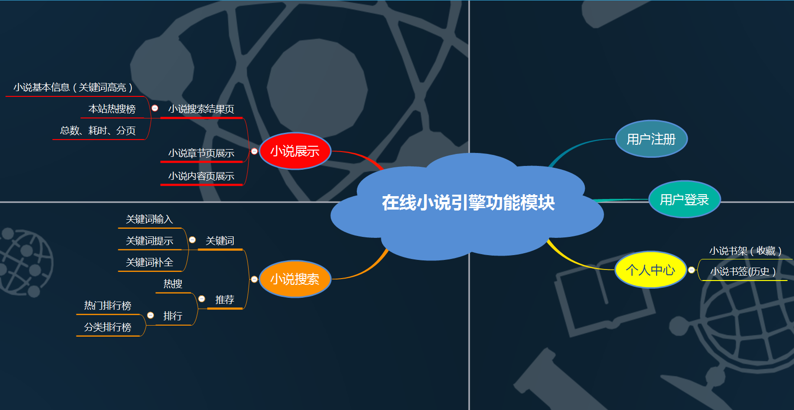
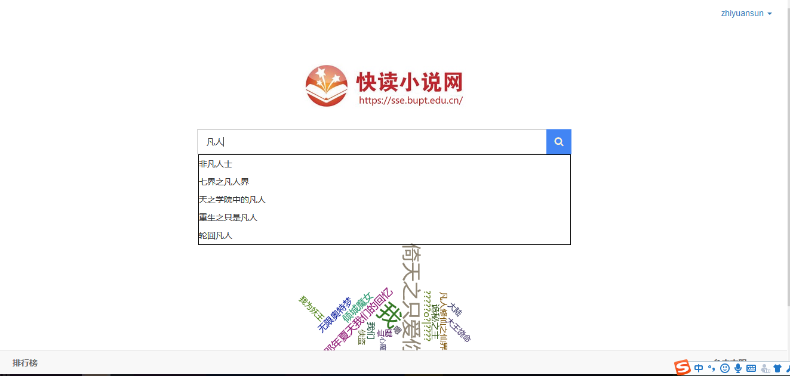
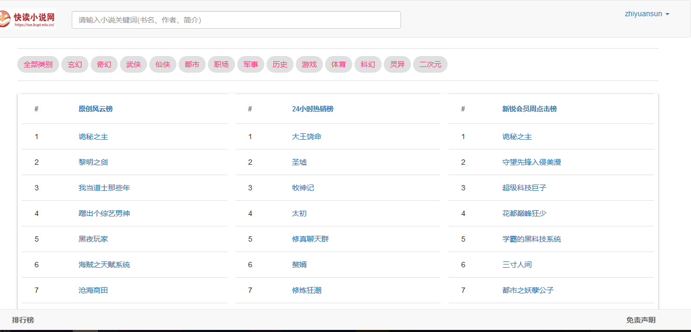
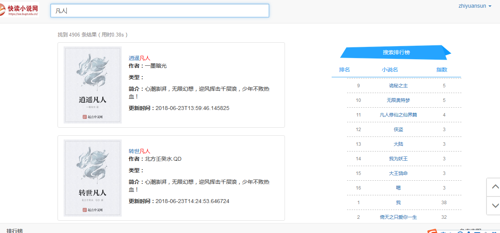
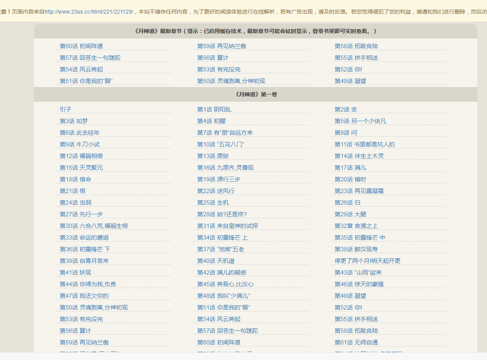
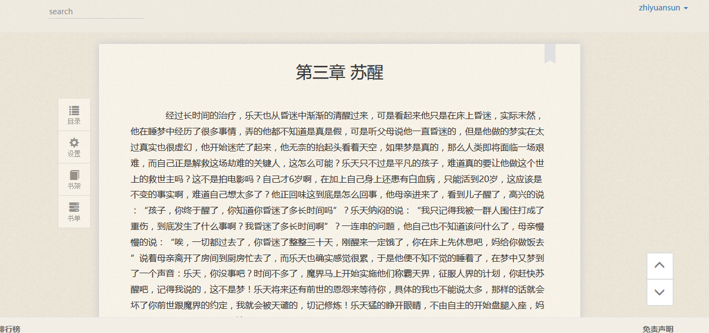
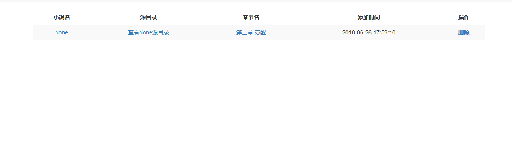

## 快阅读 - 在线小说搜索引擎（课堂练习）

本项目是一个基于其他搜索引擎构建的垂直小说搜索引擎，owllook目的是让阅读更简单、优雅，让每位读者都有舒适的阅读体验，如**搜书、阅读、收藏、追更、推荐等功能**：

- 感谢开源项目：[https://github.com/howie6879/owllook.git](https://github.com/howie6879/owllook.git)

### Overview

基于原项目，做以下修改：
- 将原搜索引擎由百度 360等替换成 基于ElasticSearch实现的全站搜索引擎。
- 首页搜索排行榜 换成自浮云展示
- 添加搜索关键词提示及自动补全功能
- 搜索结果页、实现翻页功能
- 搜素结果 关键词提示、匹配度大小顺序展示
- 搜索可以基于标题、作者及简介搜索
- 搜索结果页 -列表调整 显示封面等
- 搜索结果 添加搜索排行榜
- 去除所有 蓝色界面（对我多余）
- 添加新的解析规则，及新加爬虫

#### Installation

请先装好mongo、redis及Elasticsearch，不会安装mongo看[这里](https://www.digitalocean.com/community/tutorials/how-to-install-mongodb-on-centos-7)，不会安装Elasticsearch及配置分词器者可以参看[这篇博客](https://www.cnblogs.com/hanyinglong/p/5409003.html),也可以自己寻找教程
 装好后，进入项目目录，依照步骤执行：

```shell
# 下载代码
git clone https://github.com/howie6879/owllook
cd owllook
pip install pipenv
pipenv install --python /Users/howie/anaconda3/envs/python36/bin/python3.6
# 进入虚拟环境
pipenv shell

# 方案一
# 运行：
cd owllook
python server.py
# 或者
gunicorn --bind 127.0.0.1:8001 --worker-class sanic.worker.GunicornWorker server:app

# 方案二 推荐 
# 直接下载镜像
docker pull howie6879/owllook
# 创建dev_owllook.env文件
vim dev_owllook.env
# 写入一些环境变量
# start ===============
# 需要设置就填写  不需要就删掉
MODE=DEV
REDIS_ENDPOINT= ip
REDIS_PORT= port
REDIS_PASSWORD=''
MONGO_HOST= ip
MONGO_PORT= port
MONGO_USERNAME=''
MONGO_PASSWORD=''
# end ===============
# 运行 在dev_owllook.env里面填上数据库配置 数据库ip需要注意 请将连接ip设置为ifconfig显示的ip
docker run --env-file ./dev_owllook.env -d -p 8001:8001 howie6879/owllook:latest
# 也可以自己打包
docker build -t owllook:0.1 .
# 运行
docker run --env-file ./dev_owllook.env -d -p 8001:8001 owllook:0.1
```

#### Features

- 丰富的解析源
- 界面统一解析
- 完善的阅读体验
- 搜索记录
- 缓存
- 书架
- 书签
- 登录
- 初步兼容手机
- 注册（开放注册）
- 上次阅读记录
- 最新章节
- 书友推荐（简单地基于相似度进行推荐）
- 目录获取
- 翻页
- 搜索排行
- 章节异步加载 感谢@[mscststs](https://github.com/mscststs)
- 排行榜 - 起点+owllook
- 自带爬虫框架，统一爬虫规范 - [talospider](https://github.com/howie6879/talospider)


### Screenshots

下面是一些截图展示，具体效果图请看[这里](http://oe7yjec8x.bkt.clouddn.com/howie/2017-03-08-owllook.gif)：
整体：




首页：



分类排行榜：




结果页：




目录解析页：




阅读：




书架：




书签：


### FAQ

**为什么首页榜单为空白？**

这个是根据小说搜索次数显示的，每天刷新一次，使用多了就会有

**小说榜单页面为什么没有内容？**

需要运行`owllook/spiders/spider_console.py`，
目前代码中是设定60分钟运行一次，运行的时候请酌情更改，
`os.environ['MODE'] = 'PRO'` 这段代码也请注释掉

### Reference

**owllook使用了以下第三方包:**

- sanic：基于Python 3.5+的异步web服务器

- motor：异步的mongodb驱动

- ​Jinja2：基于python的模板引擎

- aiohttp：异步请求

- caddy：基于go的web服务器

  …...更多见Pipfile，感谢开发者

**web框架：**

- [bootstrap](https://github.com/twbs/bootstrap)：Sleek, intuitive, and powerful front-end framework for faster and easier web development. 
- [mdui](https://github.com/zdhxiong/mdui )：MDUI 是一个基于 Material Design 的前端框架

